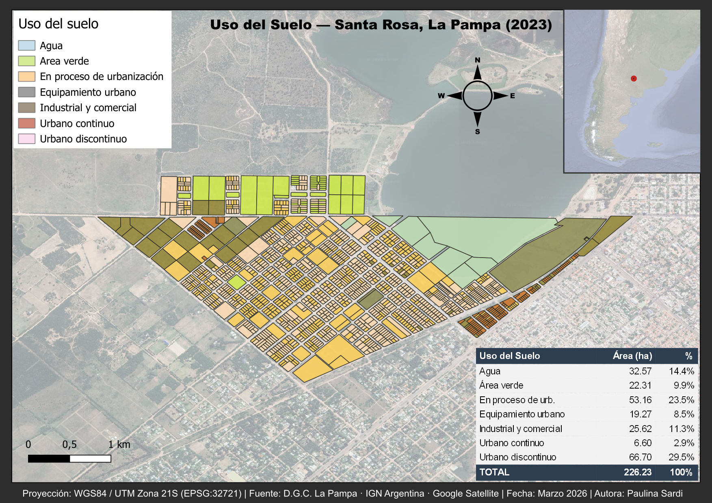

# 🗺️ P2 — Land Use Map · Santa Rosa, La Pampa

### Learning Path · Phase 1 part 2 · GIS \& Cartography

---

## Land use classification map of Santa Rosa, La Pampa (2023), 

## built in QGIS using real cadastral data from D.G.C. La Pampa.

---

## 📌 Project Goal

## Produce a professional land use map with:

## \- Categorical symbology (7 land use categories)

## \- Area statistics table with percentage breakdown

## \- Locator inset map (Argentina → La Pampa → Santa Rosa)

### \- UTM Zone 21S projection (EPSG:32721)

## \- Full cartographic layout (title, legend, scale, north arrow)

---

## 🛠️ Tools Used

## \- QGIS 3.x

## \- D.G.C. La Pampa (cadastral vector data)

## \- IGN Argentina (reference layers)

## \- Google Satellite (XYZ basemap)

## \- GADM v4.1 (Argentina provinces — inset map)

## \- Projection: WGS84 / UTM Zone 21S (EPSG:32721)

---

## 📂 Outputs

## \- `outputs/p2\_UsoSuelo\_SantaRosa\_LaPampa\_2023.pdf` — 300dpi

## \- `outputs/p2\_UsoSuelo\_SantaRosa\_LaPampa\_2023.png` — preview

--- 

## 📊 Results

## | Land Use | Area (ha) | % |

## |---|---|---|

## | Water | 32.57 | 14.4% |

## | Green areas | 22.31 | 9.9% |

## | Urbanization in progress | 53.16 | 23.5% |

## | Urban equipment | 19.27 | 8.5% |

## | Industrial \& commercial | 25.62 | 11.3% |

## | Continuous urban | 6.60 | 2.9% |

## | Discontinuous urban | 66.70 | 29.5% |

## | \*\*TOTAL\*\* | \*\*226.23\*\* | \*\*100%\*\* |

---

🖼️ Preview

===

---

## 📚 What I Learned

## \- Working with real cadastral data from official Argentine sources

## \- Categorical symbology with 7 land use classes

## \- Area statistics calculation and percentage analysis

## \- HTML tables inside QGIS Print Layout

## \- Locator inset map with province highlighting

## \- Coordinate grid with zebra frame in UTM projection

## \- Exporting maps in PNG and PDF at print quality

---

# Part of my portfolio — documenting my journey from zero 

# to professional GIS \& drone mapping technician.

# ```

