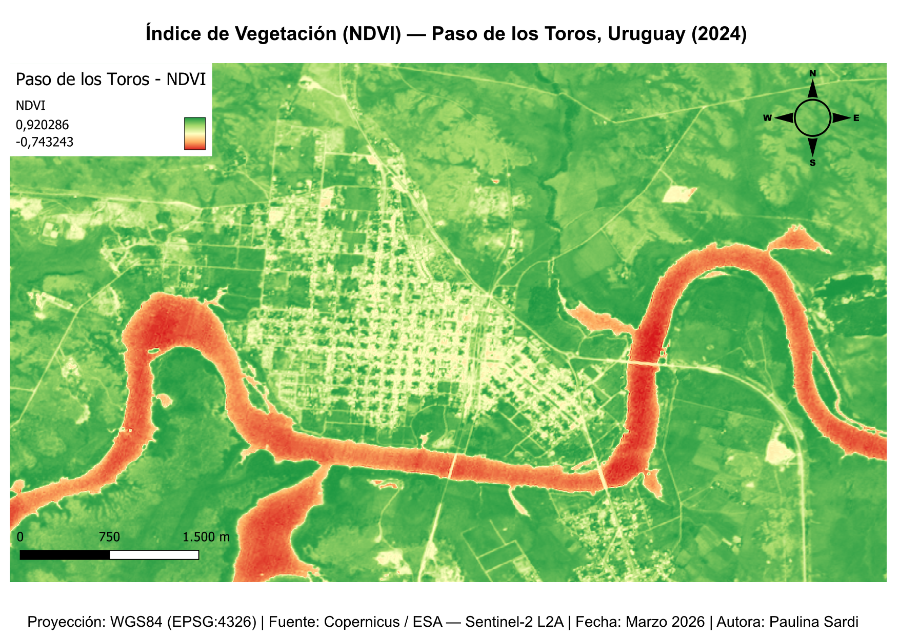
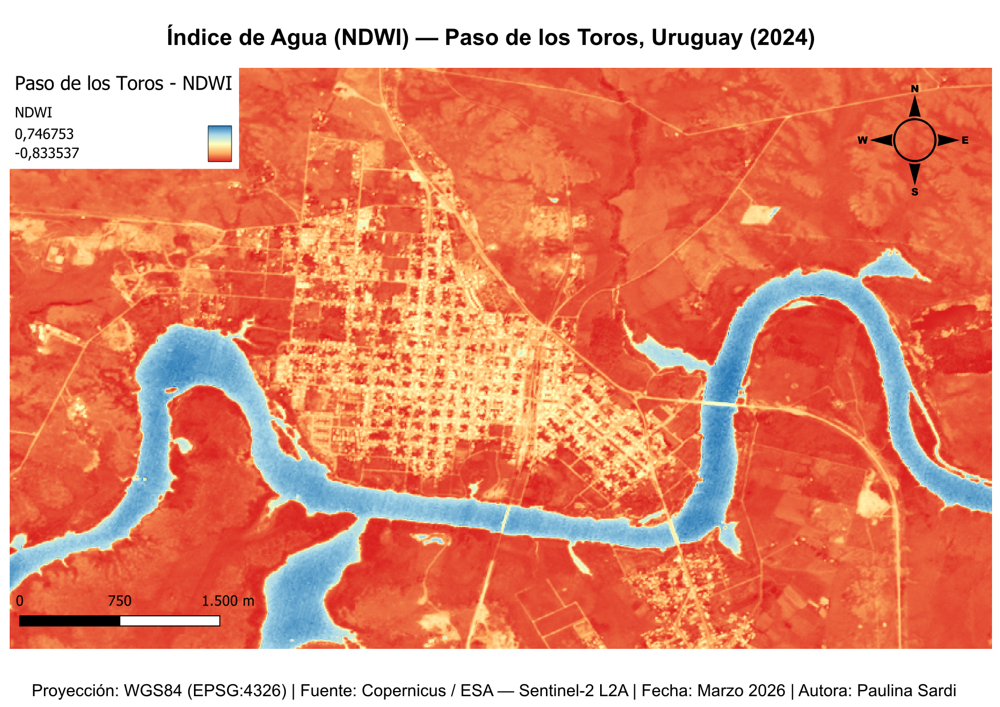

# 🛰️ P3 — Multispectral Analysis · Paso de los Toros, Uruguay
### Learning Path · Phase 1 · GIS & Cartography
Multispectral satellite image analysis using Sentinel-2 L2A data
over Paso de los Toros, Rivera, Uruguay.

---

## 📌 Project Goal
Calculate and visualize spectral indices to analyze:
- Vegetation health and density (NDVI)
- Water body detection (NDWI)
- Urban vs rural vs water land cover contrast

---

## 🛠️ Tools & Data
- QGIS 3.x
- SCP Plugin (Semi-Automatic Classification Plugin)
- Sentinel-2 L2A — Copernicus Browser
- Bands used: B02, B03, B04, B08, B11, B12
- Scene date: 2024-03-30
- Cloud coverage: <10%

---

## 📊 Indices Calculated

| Index | Formula | Purpose |
|-------|---------|---------|
| NDVI | (B08 - B04) / (B08 + B04) | Vegetation health |
| NDWI | (B03 - B08) / (B03 + B08) | Water detection |

---

## 📂 Outputs
- `outputs/Paso_de_los_Toros_NDVI.pdf` — NDVI map (300dpi, geospatial PDF)
- `outputs/Paso_de_los_Toros_NDVI.png` — NDVI map preview (150dpi)
- `outputs/Paso_de_los_Toros_NDWI.pdf` — NDWI map (300dpi, geospatial PDF)
- `outputs/Paso_de_los_Toros_NDWI.png` — NDWI map preview (150dpi)

---

## 🖼️ Preview

### NDVI — Vegetation Index

### NDWI — Water Index

---

## 💡 Key Findings
- Río Negro clearly detected with negative NDVI values
- Urban area of Paso de los Toros shows low vegetation density
- Surrounding agricultural fields show moderate to high NDVI
- NDWI accurately isolates the river from urban and rural areas

---

## 📚 What I Learned
- Downloading individual Sentinel-2 bands from Copernicus Browser
- Band stacking with SCP Plugin in QGIS
- Calculating NDVI and NDWI using the SCP Band Calculator
- Applying pseudocolor ramps for index visualization
- Exporting geospatial PDFs from QGIS Print Layout
