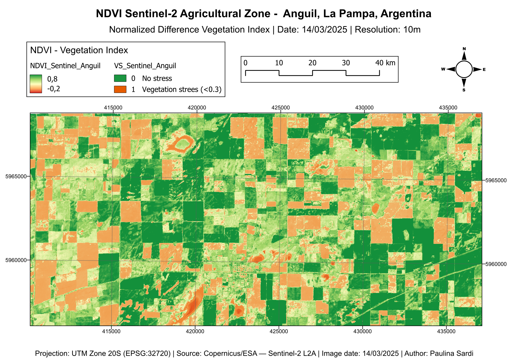
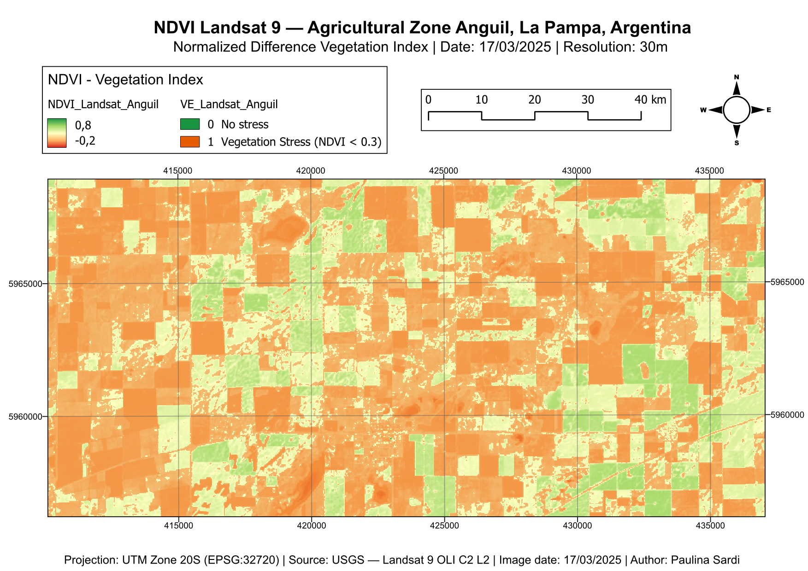

# 🛰️ P4 — NDVI Comparison: Sentinel-2 vs Landsat 9 · Anguil, La Pampa, Argentina
### Learning Path · Phase 1 · GIS & Cartography
Comparative NDVI analysis using Sentinel-2 L2A and Landsat 9 C2 L2 data
over the agricultural zone of Anguil, La Pampa, Argentina.

---

## 📌 Project Goal
Calculate and compare NDVI between two sensors to analyze:
- Vegetation health and stress zones (NDVI < 0.3)
- Spatial resolution impact on vegetation index values (10m vs 30m)
- Agricultural parcel detection capability per sensor

---

## 🛠️ Tools & Data
- QGIS 3.44
- Raster Calculator (NDVI formula)
- Sentinel-2 L2A — Copernicus Browser
- Landsat 9 OLI C2 L2 — USGS Earth Explorer
- Sentinel-2 bands used: B04 (Red), B08 (NIR) · Scene date: 14/03/2025
- Landsat 9 bands used: SR_B4 (Red), SR_B5 (NIR) · Scene date: 17/03/2025
- Cloud coverage: <10%
- CRS: EPSG:32720 — UTM Zone 20S

---

## 📊 Index Calculated

| Index | Formula | Purpose |
|-------|---------|---------|
| NDVI | (NIR − Red) / (NIR + Red) | Vegetation health & stress detection |

---

## 📂 Outputs
- `outputs/p4_NDVI_Sentinel.pdf` — NDVI Sentinel-2 map (300dpi)
- `outputs/p4_NDVI_Sentinel.png` — NDVI Sentinel-2 map preview (150dpi)
- `outputs/p4_NDVI_Landsat.pdf` — NDVI Landsat 9 map (300dpi)
- `outputs/p4_NDVI_Landsat.png` — NDVI Landsat 9 map preview (150dpi)
- `outputs/histogram_sentinel.png` — NDVI histogram Sentinel-2
- `outputs/histogram_landsat.png` — NDVI histogram Landsat 9

---

## 🖼️ Preview

### NDVI Sentinel-2 — 10m resolution

### NDVI Landsat 9 — 30m resolution

---

## 💡 Key Findings
- Sentinel-2 at 10m resolves individual parcel boundaries clearly
- Landsat 9 at 30m mixes vegetation and bare soil within the same pixel, lowering average NDVI values
- Vegetation stress zones (NDVI < 0.3) are more spatially precise in Sentinel-2
- Both sensors agree on the general distribution of healthy vs stressed vegetation
- The 30m resolution of Landsat generalizes field boundaries clearly visible in Sentinel-2

---

## 📈 NDVI Histogram Analysis

| Metric | Sentinel-2 (10m) | Landsat 9 (30m) |
|---|---|---|
| Value range | 0.0 – 0.95 | 0.0 – 0.75 |
| Main peak | ~0.20 | ~0.10 |
| Active vegetation zone | 0.20 – 0.90 | 0.20 – 0.45 |
| High vegetation (>0.6) | Present | Absent |

**Interpretation:**
Sentinel-2 captures a wider NDVI range (up to 0.95), resolving dense vegetation
that Landsat 9 cannot detect at 30m resolution. Landsat's histogram is compressed
toward lower values, with its dominant peak at 0.10 indicating that mixed pixels
(vegetation + bare soil) pull NDVI values down. The secondary peak near 0.90 in
Sentinel-2 represents dense crop canopies that are averaged out in Landsat's
coarser pixels.

---

## 📚 What I Learned
- Downloading Sentinel-2 and Landsat 9 imagery from different platforms
- Reprojecting rasters to a common CRS (EPSG:32720) in QGIS
- Calculating NDVI using the Raster Calculator
- Creating vegetation stress masks with threshold expressions (NDVI < 0.3)
- Comparing spatial resolution effects on spectral index values
- Generating and interpreting NDVI histograms
- Professional cartographic layout design in QGIS Print Layout
